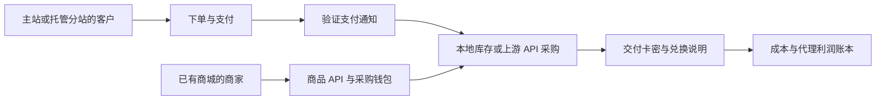

# AI代充行业内幕揭秘-独角魔改版

**一个大一学生、几乎没有编程基础，借助 Codex 将开源商城改造成实际使用的销售系统。**

作者：**Evan ｜ 云期**

这个仓库保存了我的实践过程、业务流程、部署说明和完整应用源码。集中搭建用了三天三夜，之后经历了实际销售、修补和售后。它基于 **Dujiao-Next v1.4.8** 改造；原项目提供商城基础，我提出业务需求并参与配置和实测，Codex 协助阅读、修改代码与排查故障。

## 项目近况 · 2026-10-09

我已决定不再扩大这门生意，转入库存与已有订单的收尾，将主要精力放回课程学习。收尾不代表已有订单、退款和售后责任已经结束。本仓库保留为一次 **AI 辅助搭建与真实经营的创业实验**，不再通过文稿招募代理。

我补充提供的后台展示为 **105 笔已支付订单、支付金额 36,594 元**，统计区间说明为 **2026 年 10 月 3 日至 9 日**。这些是作者提供的经营记录，不是审计结果；后台显示的 3,425.20 元“总利润”也不等于扣除全部费用后的项目净利润。原图日期标签与补充说明的差异、金额口径和限制，集中列在[项目复盘与展示](docs/项目复盘与展示.md#经营记录与统计口径)。

这次实践证明了我能够借助开源代码和 AI，把需求推进到可运行、可成交的系统；它还没有证明稳定获客、分销规模化或被动收入成立。历史供货报价、接入手册和页面截图保留作过程资料，不代表当前合作邀约。

## 为什么开源

起初，我想从分销商走到主站，把生意做大。真正搭过以后，我更想把这次实践作为自己的项目经历留下来：从发现机会、拆解上下游，到借助 AI 改代码，再用真实付款验证交付。把一个想法做成可以运行的结果，带来的成就感比单纯赚信息差更值得记录。

我把文章、流程、踩过的坑和定制源码一起分享，希望其他没有编程基础、但有想法的人少走一些弯路，也欢迎有经验的人指出问题、继续改进。开源项目给了我起点，我也想把自己的这段实践接在它后面。

## 从这里开始

| 想了解什么 | 阅读入口 |
| --- | --- |
| 经营结果、个人贡献、退出原因与下一次改进 | [项目复盘与展示](docs/项目复盘与展示.md) |
| 我怎么接触行业、为什么从代理转向主站 | [我的三天三夜](docs/我的三天三夜.md) |
| 如何从分销经历反推出整套系统 | [从分销经历反推系统](docs/从分销经历反推系统.md) |
| 订阅代充与模型 API 中转涉及哪些不同风险 | [风险说明及法规依据](docs/代充与模型中转的风险说明.md) |
| 当时如何为已有网站的商家接入商品采购 | [历史商品 API 接入操作手册 Word](docs/接入手册/商品API接入操作手册.docx) |
| 当时如何为没有网站的代理建立托管分销站 | [历史网页 API 分销站接入操作手册 Word](docs/接入手册/网页API分销站接入操作手册.docx) |
| 早期整理的 AI 代充常见问题 | [FAQ 历史补充资料 Word](docs/补充材料/AI代充常见问题解答_OpenGPT_VIP.docx)，[阅读说明](docs/补充材料/README.md) |
| 定制功能对应哪些代码 | [系统与代码导读](docs/系统与代码导读.md) |
| 在自己的机器上启动与部署 | [本地运行与部署](docs/本地运行与部署.md) |
| 原作者、许可证、公开范围 | [开源范围与来源](docs/开源范围与来源.md) |
| 准备发布到自己的 GitHub 仓库 | [发布到 GitHub](docs/发布到GitHub.md) |
| 此次打包检查与限制 | [发布包检查记录](docs/发布包检查记录.md) |

## 系统做什么

- **主站销售**：商品、订单、支付、卡密交付、使用说明与售后记录。
- **托管分销站**：代理申请、独立域名、独立售价、最低售价、店铺装修和商品图片。
- **上游采购**：绑定供应商商品与规格，客户付款后调用上游采购并接收交付内容。
- **商品 API 供货**：已有网站的商家通过接口采购部分商品，使用自己的账号与采购钱包。
- **账本**：分别记录成本、代理利润、采购钱包充值及扣款、退款与提现状态。
- **支付展示**：在支付方式上显示费率；USDT 明确网络和实际到账金额。

后端为 Go，用户端和管理端为 Vue 3 + TypeScript；数据库支持 SQLite / PostgreSQL，异步任务使用 Redis。当前域名证书运维脚本使用 SQLite，单独放在 `ops/`。



## 目录

```text
app/                  完整 Go / Vue 应用与原项目说明
docs/                 经历、流程、接入手册、代码导读和部署说明
ops/                  域名证书运维脚本与离线测试
scripts/              初始化配置、构建与公开包检查工具
compose.yml           自行构建本分支的应用与 Redis
LICENSE               GNU GPL v3
```

## 启动

安装 Docker Compose 与 Python 3 后，在仓库根目录执行：

```sh
python3 scripts/init_config.py --docker
docker compose up -d --build
```

初始化脚本会交互式询问管理员账号与密码，生成三个独立随机密钥，配置仅本地启动所需的运行文件。它拒绝覆盖已有配置。打开 `http://127.0.0.1:8080/`，后台为 `/admin`。详细配置见[部署文档](docs/本地运行与部署.md)。

**请按本仓库源码构建。** `app/scripts/dujiao-next-manager.sh` 是原项目安装器，会下载安装官方版本。此分支保持 `BuildType=source`，关闭指向原项目发布源的自动替换。

## 来源与许可证

基础项目：[Dujiao-Next](https://github.com/dujiao-next/dujiao-next/tree/v1.4.8)。我早期调研过[独角数卡](https://github.com/assimon/dujiaoka)，最后使用的代码基座是 Dujiao-Next。

本仓库继续采用 **GNU GPL v3**，保留原许可证与版权说明。发布包含代码的改造版本时应继续提供对应源码及修改说明。项目记录不代表任何学校、平台或供应商的官方背书。
