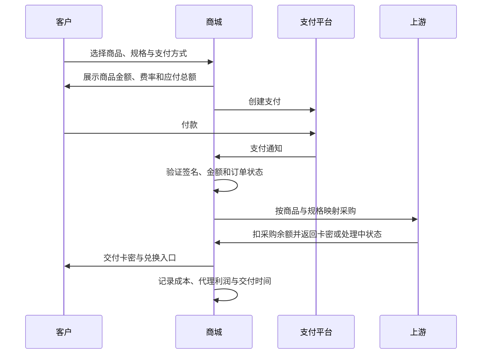

# 从分销经历反推系统

作者：Evan ｜ 云期

> **2026-10-09 状态说明：**项目已决定停止扩张并进入收尾。下文记录当时的设计、配置和操作，历史价格与接入方式不构成当前合作邀请。经营结果与反思见[项目复盘与展示](项目复盘与展示.md)。

## 我的判断怎么变化

| 阶段 | 当时看到了什么 | 我作出的判断 | 接下来做了什么 |
| --- | --- | --- | --- |
| 接触行业 | 推特上的 Bear 展示团队、销售和免费代理方案 | 买一个域名可以低成本试卖 | 注册代理并经营自己的托管分站 |
| 开始销售 | 社区帖子带来订单；Plus 代理价为 120 元，其他渠道报价更低 | 可能存在可争取的供货差价，也有实际需求 | 寻找上游，考虑建立主站 |
| 比较业务风险 | 订阅交付与模型 API 中转经手的服务、数据和资金环节不同 | 当时认为具体商品交付更容易理解和管理，风险仍须按实际行为判断 | 选择先做订阅交付，继续核实采购、支付、账号资料及跨境结算边界 |
| 决定建站 | 原平台控制商品、供价和系统 | 自己经营主站可以选择上游，也能服务自己的代理 | 购买域名和服务器，尝试根据网页与截图还原系统 |
| 还原受挫 | 用 Codex 改了很久，始终达不到想要的效果 | 页面看不到完整后台逻辑，单靠猜测难以复制功能 | 几乎想放弃，继续寻找可用的源码 |
| 发现开源项目 | GitHub 上的独角项目与原网站的页面和功能很像 | 可以从已有源码出发，逐项实现需要的功能 | 选择 Dujiao-Next，让 Codex 读代码并做定制 |
| 拆解系统 | 分销后台的域名、售价、利润和提现页面 | 几个简单按钮背后有一整套后台流程 | 将截图与操作手册交给 Codex，逐环节提出需求 |
| 实际交易 | 支付、到账、交付与退款出现不同问题 | 页面完成不能替代真实订单验证 | 自己真实购买、观察卡密交付并测试退款 |
| 上游开放 API | 商家接受将库存转为余额，并提供接口 | 可以按订单采购，减少手工补库存 | 绑定商品和规格，接入采购与交付流程 |
| 对其他商城供货 | 有人已经有网站，只需要补充几件商品 | 可以保留对方商城，通过采购接口提供货源 | 开放商品 API，分别设置供价与采购钱包规则 |
| 补充人民币支付 | USDT 对没有钱包或不熟悉链上操作的人形成门槛 | 付款入口也会影响客户能否完成购买 | 配置聚合支付支付宝渠道，披露费率与实付金额 |
| 继续经营 | 代理增长没有跟上预期，售后仍需要我 | 搭站与获得客户是两项工作 | 记录真实交易、持续处理售后，整理经历开源 |
| 决定收尾 | 日常关注、维护和售后挤占课程学习，收益没有达到原先预期 | 有成交不等于适合持续投入；技术完成不等于经营模式成立 | 停止扩张，处理库存与已有订单，保留代码和复盘 |

供货差价是我最初的推断，当时并不知道其他主站的实际采购成本。对方展示的业绩和渠道承诺也属于我当时看到、听到的信息。

业务风险的选择也属于我当时的判断。商品采购 API 返回卡密，模型 API 中转返回生成内容，两者承担的责任不同；低流水、能开发票或没有查到同类案件，都不能代替合规核查。具体依据见[代充与模型中转的风险说明](代充与模型中转的风险说明.md)。

## 一条订单怎样走完

供应商异步处理时，商城需要通过通知或查询取得结果。超时不能直接视为采购失败后无限重买；付款、采购和交付需要保留各自的状态。

我的商品交付形式是卡密与兑换说明。客户拿到卡密后到供应商指定入口兑换；商城显示已交付，表示卡密已提供给客户，兑换结果仍应以供应商为准。

## 卡密、Session、卡网与卡台

| 名称 | 在这套流程中的作用 |
| --- | --- |
| 卡密 | 购买商品后获得的兑换凭证，用于兑换对应订阅服务 |
| Session | 账号登录会话，含敏感登录凭据，供兑换方识别目标账号 |
| 销售卡网 | 展示商品、收款、订单、采购与交付卡密；这是我搭建并整理开源的部分 |
| 上游兑换卡台 | 验证卡密、核对目标账号和套餐、执行充值并返回结果；由供货方提供 |

这些行业叫法可能混用，本文按功能划分。供应商的[公开兑换页面](https://aisub.online/)依次要求验证卡密、提供目标账号登录态、核对并提交处理。Session 应当像登录凭据一样保护，不能公开写进仓库或群聊。

搭建销售卡网的基本步骤是：部署商城源码 → 接域名与 HTTPS → 配置商品规格 → 导入库存或绑定上游 API → 配置支付及通知 → 配置交付说明、售后与账本。自行建立充值执行平台还需要实际充值渠道与对应任务处理；本仓库的商城源码不包含供货商的全部充值实现。

## 从人工拿货到按订单采购

最初由我手动购买并导入本地卡密，商城在客户付款后自动分配库存。人工发生在采购与补库存，客户交付可以自动进行。

后来，商家回收我剩余的卡密，将金额转为上游采购余额。我停用这些旧卡，再绑定每一件本地商品与上游的商品和规格。这样，客户付款后，商城可以向上游按订单采购，再交付取得的卡密。未售卡密占用资金的问题，变成了采购余额、供应商可用性和结算管理的问题。

上游当时先按商城价扣款，我每隔三天人工核对补差充值。因此采购系统分别记录实际扣款与约定成本，补差需要另外核对；公开文稿不披露作者的实际采购金额。

## 两种分销，分别解决两种需求

| 项目 | 没有网站：托管独立域名店铺 | 已有网站：商品 API |
| --- | --- | --- |
| 页面和服务器 | 主站提供并统一托管 | 商家保留自己的页面与服务器 |
| 商家准备 | 账号、域名、店铺设置 | API 账号、适配代码、采购余额 |
| 终端客户收款 | 平台统一配置的渠道 | 商家自己网站的渠道 |
| 商品交付 | 平台订单直接触发 | 商家服务器请求我们的采购接口 |
| 商家利润 | 零售价与代理供价的差额记入代理账本 | 商家在自己的商城核算零售价与 API 采购价的差额 |
| 资金机制 | 代理利润待确认、可提现、提现记录 | 充值采购钱包，采购时扣余额 |

托管店铺并非给每个域名重新安装一套程序。程序按访问域名识别店铺，将共享商品目录与该店铺的售价、图片和装修组合起来。

对已有卡网开放商品 API 时，供货流程是：下游商城收到客户付款 → 调用我们的接口并使用采购钱包余额付款 → 我们向上游获取商品 → 返回交付结果 → 下游商城发给客户。客户在下游商城付款，采购余额在我们这里扣款，两笔订单需要对应。

这是“第二上游”的业务位置：我向供应商采购，再向下游商城供货。页面仍是对方的，支付也由对方处理；对方需要支持采购协议或增加接口适配，不能保证所有网站填入凭据就自动兼容。

按我当时补充的经营经历，曾有商家上架我的商品，在我这里充值采购余额并拿货。这是当时的使用进展，不代表已经形成稳定供货规模，也不代表当前仍开放接入。

## 分销商与独立主站的取舍

| 项目 | 托管分销商 | 自己经营主站 |
| --- | --- | --- |
| 起步 | 我当时主要付域名费，无需部署 | 域名、服务器、支付服务与采购周转都要准备 |
| 日常精力 | 主要用于获客、销售和客户沟通 | 还要承担系统维护、供货、支付异常和售后 |
| 选择权 | 商品与供价由主站提供 | 自己选择供应商、定价和业务流程 |
| 收入路径 | 零售价与代理供价的差额 | 主站零售、托管代理和商品 API 供货 |
| 主要限制 | 受主站商品、规则与稳定性影响 | 固定费用、技术维护与供应商风险由自己承担 |

我从分销转向主站，是想获得供货选择权并发展代理。这个选择扩大了可做的事情，也增加了成本和责任。原来作为分销商能卖出商品，不等于建好主站后会自动获得更多客户或代理。

## 域名为什么需要后台支持

域名购买平台与 DNS 平台可能不同，后缀也不是决定性条件。一键接入需要平台先配置入口、证书和店铺绑定；代理授权后代写 DNS 只解决解析记录这一环节。已有冲突解析或其他店铺占用时应停止。

## 三种价格、两种余额

价格分别是：**最终采购成本、代理或 API 供价、客户零售价**。订单需要保留成交时的价格，后续改价不能改写历史利润。

主站零售收入、托管代理供价与商品 API 供价是不同的收入路径，都需要扣除对应的采购成本，再核算支付、退款和运营费用。公开文稿只列托管分销站报价，商品 API 具体供货价、采购金额与可反推采购金额的差价算例不公开。

**采购钱包**是商家预付用于拿货的钱；**代理利润钱包**是托管店铺产生的待确认利润。它们用途不同，不应把充值额记作销售利润。

上游先按商城价格扣款，再人工补差的情况下，账本需要区分实际扣款与约定成本。供应商补差属于待核对事项，不能因预计会补就视为现金已经收到。采购钱包需要充足余额，不能只看利润表是否为正。

## 搭建与持续运行费用

我当时购买主域名 evanaishop.com 为 10 美元／首年，测试分站域名 openanthropic.xyz 为 2.2 美元／首年，早期域名 openanthroai.com 为 10 美元／首年，合计 22.2 美元。服务器 95 元／月，DujiaoPay 的 BSC 收款起步套餐 10 美元／月；搭建期间使用的 ChatGPT 订阅 200 美元／月，单列为工具费用。

按一月服务器、一月网关、一月工具订阅加三个域名，初期这几项支出为 95 元＋232.2 美元。当前主站与测试域名的首年费用按十二个月均摊，加服务器和网关，网站月均约为 95 元＋11.02 美元，工具费用另计。域名将来续费按实际账单；采购余额作为周转资金管理，商品成本按订单核算。

## 历史接入方式与托管分销站报价

当时，没有自己网站的人可以申请托管分销站，准备域名后接入平台提供的页面、服务器、支付与交付能力，不收代理费。已有独立站的人可以保留原网站与支付，接入商品 API，通过采购钱包拿货。

托管分销站报价记录于 2026-10-05，单位为人民币元／份，仅用于说明当时的定价与接入设计，不代表当前供货承诺。商品 API 具体采购金额不公开。

| 商品 | 托管分销站拿货价 |
| --- | ---: |
| Plus | 113 |
| Pro 5x | 645 |
| Pro 10x | 1050 |
| Pro 25x | 3140 |

当时使用的主站域名为 `evanaishop.com`。商品 API 要求对方网站支持采购协议或有对应适配；本文不再提供新代理接入邀约。

## 支付入口如何补齐

最初使用 USDT，从 TRON 转向 BSC，减少小额商品转账的费用负担。客户仍需要正确选择网络，并保证扣除交易所提现费用后的实际到账数量与收银台一致。

为了让没有 USDT 的客户也能购买，我又联系聚合支付平台。我在 Bear 的开发票微信群里看到有人提供开票联系，推测他可能也提供收款服务，便加微信继续了解，之后接上聚合支付。能开票的人未必都提供收款，这是我当时找渠道的判断过程。

接入时，配置商户编号、接口地址、密钥、支付宝渠道与付款回调。支付平台开通商户渠道，商城配置对应接口，两边缺一都不能据此判断可用。

支付宝付款通知核对完成后，进入原有采购与交付流程。结账页提前显示费率、手续费和应付总额；后来费率调整为 1.5%，后台保留修改入口。微信保持关闭，USDT 保留。支付接口配置与真实付款结果仍需分别记录。

USDT 识别看的是链上实际收到的网络、代币、地址与金额，交易所填写的发送数量可能被提现手续费扣减。例如要求到账 18.6567 USDT，本次手续费从提现数量扣 0.1 USDT，就应按该规则发送 18.7567，并核对预计到账为 18.6567。手续费另收时则按另收规则填写，不能固定给每笔转账加 0.1。

支付平台确认匹配后通知商城，商城核对通知再更新订单并进入交付；少到一点不会因为客户点击“已经付款”就自动补成正确金额。需要链上转账记录，交易所内部划转也不能替代对应网络的链上付款。

## 异常和退款怎样收尾

客户提出退款 → 我核对订单和交付问题 → 在支付平台申请退款 → 支付平台处理 → 我确认商城订单状态及金额 → 系统对应调整利润和账本。上游采购退款另外与供货商核对。

托管代理利润在实际交付满 92 小时、没有异常或退款时自动转为可提现，人民币净可提现余额满 50 元可以申请，单次申请金额需大于零且不超过净可提现余额。申请提现时应锁定相应金额；管理员实际打款成功后登记，拒绝申请则释放锁定金额。

## Codex 如何参与

我的工作是提供经历和截图、决定业务规则、购买并配置账号服务、真实下单和反馈错误。Codex 帮我读现有代码、实现改动、运行可用的检查，并排查部署问题。

有效的需求逐渐变成具体问题：这个价格存在哪里？哪个状态才触发采购？同一个通知来两次怎么办？退款会影响哪一笔利润？一张图片属于哪个店铺？

项目能够复用的部分，是这些问题对应的流程和代码。经营结果仍取决于需求、供货、服务与成本。
