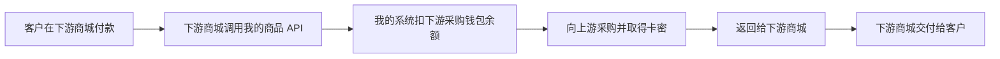

# 揭秘AI代充行业：一个大一学生如何用codex三天跑通AI代充行业的总流程

作者：Evan ｜ 云期

> **2026-10-09 更新：**我已决定结束扩张、转入库存与已有订单的收尾，把这次实践保留为项目经历。正文记录当时怎样搭建和经营，不再作为代理招募文案；已有订单与售后仍需负责。最新经营记录、贡献分工与退出复盘见[项目复盘与展示](项目复盘与展示.md)。

我在2026年九月30日开始在x接触到这个行业
因为我本身也是codex的重度用户
在偶然看到有人发GPTI代充招代理帖子的时候
跟我现在订阅的chatgpt价格居然相差这么多
惊讶于代充价格居然这么便宜 省事 不封号 还可以开发票
这么多优点
后来我敏锐的发现了商机 以plus为例
在墙内plus的价格大多是140 甚至有的能卖到170的天价
而菲律宾区的订阅999php折算成人民币只要108元
有很大的差价 
AI时代 ，天马行空的想象力和变态的执行力是最大的竞争力
当你看到机会在眼前， 就不要犹豫

下面是我当时在国内平台看到的几份报价。不同渠道的标价差异，让我开始关注这门生意里的供货和定价。

  
  
  

*图：我当时在国内平台看到的商品页与广告标价，点击可看原图。中间的商品采用其他名称，套餐并未在截图中明确；这些截图记录页面报价，不能当作实际成交数据。*

我是一个大一学生，开始做这件事的时候，几乎没有编程基础。我没有先学完一套课程，也没有先写出一个完整的商业计划。我先当了别人的分销商，卖过商品，看到这套流程能够运转，才开始想：既然我能在别人搭好的体系里卖货，能不能把这个体系拆开，搭出属于自己的主站？

于是，我买服务器、买域名，在 GitHub 上找开源项目，让 Codex 帮我读代码、修改功能、部署和排查问题。集中搭建的那三天三夜里，我反复在商家后台、自己的商城、分销站和各种配置页面之间切换，直到真实付款后，订单里出现了应该交付的卡密。

这篇文章记录了我怎样借助 Codex 完成一次实际搭建。代码主要由 Codex 协助编写，我负责提出需求、判断方案、配置账号和服务、实际购买测试，再把遇到的问题反馈给它。三天三夜指集中搭建阶段，不是完整经营周期；网站跑通以后，我又经历了实际销售、修补和售后，最终决定收尾。

## 我先从别人的分销商开始

我最初是在推特上看到一个叫 Bear 的人做 AI 代充。他展示的团队规模和销售额都很吸引我。我当时看到的是他的展示，并没有审计过这些数字，但这让我第一次认真关注这门生意。

对我来说，吸引点很直接：代充价格比我了解到的美区订阅价格低，直接充到自己的账号里也方便。对方还宣称有不会封号的渠道、可以开发票。这些是我当时听到的说法，我不能把它们写成对所有交易都成立的保证，但它们确实影响了我最初的判断。

更重要的是，加入代理不收费用，只需要自己买一个域名。我觉得试一试的成本不高，便按操作手册申请代理、接入域名、设置售价。很快，一个看起来独立的网站就出现在我的域名下。客户在这里下单，平台负责收款和交付，我赚供货价与售价之间的差价。

我开始在社区发帖子，起步的几篇帖子带来了不少订单。这让我有了信心：我并非只有一个想法，确实有人愿意通过我购买。与此同时，我发现 Plus 的代理拿货价是 120 元，而其他渠道的报价能低几元。我据此推测，主站在代理供货环节也可能保留了一层差价。那时我还不知道对方的真实采购成本，但开始想，既然差价存在，我能不能自己选择上游？

*图：我最初做代理时，上家的页面显示 Plus 供价 120 元、最低售价 127 元；Pro 5x 供价 665 元、最低售价 695 元。这是当时的代理报价，也是我后来想自己寻找上游的原因之一。*

当时，我不用购买服务器，也不用自己开发商城，但商品、供货价格和系统能力都掌握在上游手里。我能决定怎样卖，却很难决定这套生意怎样运转。这是我从代理转向主站的第一个推动力：争取供货和系统选择权。

另一个推动力是规模。我希望其他人也能像我最初那样，只准备一个域名，就加入一起销售。我不打算收代理费，而是希望主站向代理提供商品，代理自己定价，靠每一笔真实订单的商品差价获利。我的设想是，自己卖货的同时，让更多代理持续销售，再用新增收入改善系统和供货，慢慢滚起一个雪球。

这个想法听起来很简单。但从一个现成体系的使用者，变成需要负责整个体系的人，中间隔着很多原来根本不用我考虑的问题。

## 搭建以前，我也先考虑过风险

决定买服务器、自己搭主站以前，我先想过：这门生意除了能不能卖出去，还有哪些责任要由我承担？我比较了订阅代充和自建 AI 模型 API 中转服务。当时我认为，围绕具体订阅商品做采购、交付和售后，业务范围更集中，自己相对更容易理解和管理，才决定从这条路开始。

这两种 API 也需要分清。我的商品 API 接收采购订单，返回卡密；模型中转服务接收用户的问题，调用模型，再返回生成内容。它会持续经手用户输入和模型输出，需要考虑相应的服务与数据责任。

| 比较的环节 | 订阅代充与卡密销售 | AI 模型 API 中转 |
| --- | --- | --- |
| 业务与资金 | 核实采购来源、授权、收款结算和售后；真实交付也不能自动证明资金链合规 | 还要核实模型接口来源、对外服务资质及适用的生成式 AI 监管要求 |
| 网络访问 | 看采购与兑换实际使用的网络方式 | 看请求怎样跨境、是否提供未经许可的联网通道；境外调用本身不能直接等同犯罪 |
| 用户数据 | 订单资料、账号信息、Session 同样需要保护 | 用户提问可能包含个人信息或重要数据，需要判断出境条件与保护义务 |
| 经营记录 | 订单、资金和兑换记录可以用于核查实际交易 | 日志与调用记录也可以作为证据；是否违法仍取决于具体行为 |

整理经历时，我又核对了网上流传的“流水到 250 万才有非法换汇风险”。这个说法不准确：相关司法解释针对的是已经属于非法支付结算或非法买卖外汇的行为，一般以非法经营额 500 万元以上或违法所得 10 万元以上作为“情节严重”的数额标准；250 万元以上或 5 万元以上还附有特定条件。商城流水不能直接等同涉案金额，低于刑事标准也不排除行政责任。[两高司法解释](https://www.court.gov.cn/zixun/xiangqing/141542.html)、[官方行政刑事衔接说明](https://www.safe.gov.cn/zhejiang/2025/0513/2184.html)

中转服务已有能够确认的处罚。2026 年 9 月，网信办通报江苏一家公司经营两个 API 中转网站，因未按规定开展安全评估，被责令改正并警告。通报没有说明模型是否来自境外，也没有公布刑事入狱判决。我不能把它写成“做中转就会被判刑”，也不能用没有查到同类代充案件来证明代充安全。[官方案例第 10 起](https://www.cac.gov.cn/2026-09/15/c_1790876152357946.htm)

我选择订阅交付，是当时对业务范围和自己能力的取舍。做到主站以后，采购授权、支付渠道、客户资料和跨境结算仍需要持续核实；尤其 USDT 的收款与兑换，不能因为技术上能确认到账，就认定资金安排已经合规。[2026 年虚拟货币风险通知](https://www.csrc.gov.cn/csrc/c100028/c7614318/content.shtml) 更完整的比较与法规依据放在[风险说明](代充与模型中转的风险说明.md)里。

## 从我用过的页面，反推出背后的流程

我没有源码层面的经验，最先能拿来研究的，就是自己当代理时见过的页面和操作手册。我把申请代理、域名接入、商品定价、利润查看、提现这些步骤和截图拿给 Codex，要求它沿着真实操作过程分析，而不是随意设计一套新玩法。

例如，我只买了域名，为什么打开以后就会出现一整套商城？这让我逐渐弄明白：域名本身不会生成网站。原来的模式是平台统一托管，根据访问的域名找到对应店铺，再展示代理自己的名称、图片和售价。后来我又想让已经有网站的人从我这里拿货，才明白这是另一条路：对方保留自己的商城，用商品 API 向我采购。这两种模式需要分别实现。

售价也不能只是一个前台输入框。代理看到的是供货价，客户看到的是零售价，订单需要记录当时的价格，支付完成后才能计算代理利润。后来我又加了最低售价，防止代理随意压价；让他们能修改自己店铺的商品图片，同时保证修改只在自己的分站生效。

我对钱包的理解也从“显示一个余额”变成了“一套账”。订单产生利润，利润先等待确认；后来我把规则设为交付满 92 小时，没有异常或退款，再转为可提现余额，余额满 50 元才能申请提现。实际打款仍由我人工处理，后台需要记录这笔款的状态，不能把显示余额当成已经转账。

我开始意识到，之前那份几分钟就能完成的手册，实际上把很多后台工作藏在了用户看不到的地方。

## 我先弄懂了卡密、Session 和卡台分别做什么

一开始，这些词在我眼里都很陌生。后来我把它们对应到实际操作，才逐渐弄清楚各自的作用。

**卡密**是一串用于兑换商品的凭证。客户买到卡密，就相当于拿到一份已购买商品的兑换资格；它本身并不是 ChatGPT 账号，也不是 OpenAI 的 API 密钥。

**Session**是账号当前的登录会话信息，其中可能包含可以代表账号登录的凭据。在这类代充流程中，卡密用于确认买了什么商品，Session 用于识别需要充值的账号。客户在自己的浏览器登录账号，到兑换入口先验证卡密，再按提示提供登录态，核对目标账号与套餐，最后提交处理并查看进度。这是我所用供应商的[公开兑换流程](https://aisub.online/)。

我提供的是商城、卡密与兑换说明，具体怎样执行充值由供货方处理。我没有掌握或验证它背后的全部实现。Session 应当像登录凭据一样保护，不能当成普通的订单信息发到群里或放进开源仓库。

**卡台、卡网**在行业里的叫法并不完全统一，我按它们的功能分开理解：销售卡网负责展示商品、收款、记录订单和交付卡密；客户拿到卡密后访问的上游兑换卡台，负责核销凭证和处理充值。我建立的是销售卡网，并向其他商城开放商品采购 API，充值执行仍由供货方的平台处理。

建立卡网的过程也因此可以拆开：选择商城源码 → 部署服务器并接域名 → 配置商品和规格 → 导入卡密或接上游 API → 接入支付通知 → 配置交付说明和售后。每一步都有对应的软件、账号或供应商，后面就是我怎样把这些环节逐一接起来的。

如果连兑换充值的平台也要自己建立，还需要实际可用的充值渠道、卡密核销、目标账号核对、充值任务处理、结果查询和异常售后。商城源码提供的是销售基础，我这次通过供应商现成的兑换平台把后面的服务接上。开源包里会说明这两部分的分工。

## 在 GitHub 找到起点，再把它变成我的系统

我最开始的想法很直接：既然浏览器里已经有一个完整的网站，能不能根据它的页面和操作，反推出源码，再让 Codex 帮我照着做一套？我把截图和需求一遍遍交给它，希望把原来用过的功能复制下来。

但我让 Codex 改了很久，始终达不到想要的效果。页面上能看到按钮，却看不到按钮背后的订单、权限和账本怎样连接。单凭网页猜这些流程，比我最初想象的难得多。

改了一轮又一轮，我越来越灰心，甚至开始怀疑：一个没有编程基础的大一学生，想自己搭主站，是不是太想当然了？那时，我几乎想要放弃。

这三天三夜，我一遍遍用 Codex 改代码、部署和排查问题，也伴随着很高的工具使用量。我保留了搭建期间的账号 Token 活动截图：页面显示，2026 年 9 月 27 日起的一周累计为 24.5 亿 Token。

*图：当时的账号周统计，反映工具使用强度；它没有单独拆分这个网站项目，也不能直接用来计算实际计费金额。*

转机是在 GitHub。我发现了独角系列的开源项目，看到熟悉的页面结构和功能，和我原来使用的网站非常像。那一刻我特别惊喜：原来这套东西有现成的开源基础！我当时的第一反应就是，这下终于有机会把想要的功能准确地做出来了。

有了源码，我可以让 Codex 直接读程序，找到每个功能对应的模块，再沿着已有结构修改。此前一直靠页面猜测的流程，终于有了能查看、能运行的起点。我又比较了独角数卡和异次元发卡系统，最终选择 Dujiao-Next，在它的基础上做定制。

这一步对我很关键。开源项目提供了商品、订单、账号、后台等基础能力，我不必重新发明所有模块；但“已经有商城源码”也不意味着我想要的托管分销、域名接入和利润规则会自动存在。哪些能沿用，哪些需要修改，仍然要逐项确认。

我把需求交给 Codex，让它先看现有代码，再把流程接上。我的提问也慢慢从“做一个和截图一样的网站”，变成更具体的问题：这个按钮保存到哪里？付款回调之后触发哪一步？代理改图片会不会影响主站？退款之后利润怎样撤销？每次找到一个问题，就沿着它继续往下拆。

域名接入就是一次很长的折腾。我买过不同的域名，也误以为域名后缀或购买平台会直接决定能不能接入。后来才理清，注册商、DNS 平台和承载网站的服务器是不同的东西。要让代理只操作几步，我的平台必须先做好统一入口、域名归属验证、证书和店铺绑定；一键代写 DNS，只是在这些基础上增加方便。

我后来把 evanaishop.com 作为主站，建立新的分销入口，再用自己的分站域名验证公网访问。域名能解析，还需要 HTTPS 正常；页面能打开，还需要后台识别正确的店铺。这些问题不能靠看到一个绿色按钮就判断完成。

## 第一步：人工拿货，把卡密放进自己的库存

主站刚建立时，我还没有上游 API。我的办法很直接：先找商家买卡密，再把它们导入自己的卡网。客户在我的网站付款后，系统从库存分配一张卡密，显示兑换入口和使用说明，客户再到指定入口自行兑换。

这里有一个我后来才分清的区别：人工拿货，不等于人工发货。采购和补库存由我手动完成，付款后的卡密分配可以交给商城自动处理。只要库存够，客户下单时不需要等我上线一条条回复。

我最开始拿到一张 Plus 卡密，把兑换网址和说明放进交付页面，再用自己的分销站真实购买。付款后，订单里出现了卡密，我才确认收款、订单和交付在这笔交易里接上了。我也补充了一个容易混淆的说明：Plus 和几档 Pro 卖的是一个月订阅，卡密不会过期，指的是它的兑换期限；不会过期的卡密不等于永久会员。

随后我又导入了一批 Plus 和 Pro 5x。这个阶段让我摸到了实际经营的细节：哪些卡已经售出，哪些还可分配，缺货时商品怎么办，客户拿到卡却兑换失败该找谁。看起来只是往后台粘贴几行卡密，背后却有采购资金、库存和售后。

这个办法可以起步，但单量一多，我就得不断预付资金、补库存。某个商品卖得快，容易突然缺货；卖得慢，钱又留在库存里。我开始想，能不能让采购也跟着真实订单发生？

## 第二步：接入上游 API，让采购跟着订单走

后来，供货商主动找到我，说可以申请 API 对接。他可以回收我手里剩余的卡密，转成他网站上的采购余额，以后通过接口自动拿货。

这让我看到了一条更适合继续经营的路径：我不必预测每个规格要囤多少张卡，而是先保留采购余额，客户真正付款后，再向上游购买对应商品。已经被回收的本地卡密则要停用，避免网站把不该继续卖的旧卡发给客户。

我申请了上游的 API 凭据，让 Codex 按对方接口对接，再把本地商品和上游商品、规格逐项绑定。Plus、Pro 5x、Pro 10x 必须各自对应，不能只填一个 API 地址，就认为所有商品都能自动交付。

新的流程变成了：

**客户付款 → 我的商城确认订单 → 向上游采购对应规格 → 上游扣采购余额并返回卡密 → 我的商城交付卡密和兑换说明。**

上游如果没有立即返回结果，系统就要保存采购记录，再通过通知或查询取得交付结果。同一个付款通知重复到达，也不能再买一遍。这些细节决定了接口接通以后，能不能作为一条持续运行的供货流程。

我和商家谈到了更合适的供货价格。不过，对方当时先按商城售价扣采购余额，我每隔三天再人工核对补差，充回上游余额。

约定成本和实际扣款需要分别记录，补差有没有到账，也要自己核对。按订单采购减少了手工补卡，但采购余额和供应商结算仍需要有人管理。

## 第三步：把自己作为第二上游，向其他卡网供货

接上上游 API、配置好商品映射后，我又想到一个问题：如果有人已经有自己的卡网、自己的客户和支付渠道，只是缺这几件商品，为什么一定要让他重新开一个我的分销站？

于是，我把自己的供货能力再开放成商品 API。对方保留原网站，只接入需要的几件商品；他的网站收到客户付款后，由他的服务器向我的接口采购。我再向上游获取商品，把交付内容返回给他，由他的商城发给最终客户。

这就是我理解的“第二上游”：我从供货商这里采购，再为下游商城提供商品、接口和售后联系，而不是要求对方把整个网站迁到我这里。

资金也各有归属：最终客户的钱由下游商城收取；下游商家先在我这里充值采购余额，拿货时按商品 API 价格扣款；我再使用自己的上游采购余额拿货。采购钱包里的充值是商家的预付款，不能直接把它全部算成我的利润。

下游商家按自己的客群确定零售价，赚零售价与 API 拿货价之间的差额；我则提供供货与接口服务。两边都要核算支付、退款和运营费用，不能把销售额或钱包充值额直接当成利润。

采购余额也需要留足。上游先扣款、之后再补差，会占用周转资金；账面有利润，并不代表这笔钱已经到账。

现在已经有商家上架了我这边的商品，在我这里充值采购余额并拿货。我的角色开始从自己卖给最终客户，扩展到向其他商城供货。

这条路的价值，是让已有网站的人多一种供货选择。对方的网站仍需要支持我的采购协议，或者增加适配代码，商品 API 也不会自动替他生成网站。后面我还要继续看供货能否稳定、售后怎样处理，以及这样的合作能否持续。

## 回头比较：做分销商，还是自己搭主站？

这两种角色我都做过，感受很不一样。做分销商时，我主要考虑去哪里找到客户、怎样介绍商品；自己搭主站以后，服务器、供货、支付、域名、账本和售后都成了我要负责的事。

| 比较 | 做托管分销商 | 自己经营独立主站 |
| --- | --- | --- |
| 启动成本 | 我当时加入不收代理费，主要付域名费 | 需要域名、服务器、支付服务及采购周转资金 |
| 技术与维护 | 主站提供页面和程序，较快开始销售 | 需要部署、修改、备份和处理故障 |
| 商品与供价 | 用平台提供的商品，拿货价受平台影响 | 可以自己选择上游、谈价格、扩充商品 |
| 利润空间 | 赚零售价与代理供价的差额 | 可以同时做主站零售、托管分销和商品 API 供货 |
| 灵活程度 | 通常能改店铺名称、图片和售价，其他能力由平台决定 | 可以决定流程、接口和业务规则，也要自己维护它们 |
| 售后与风险 | 原平台承担主要系统和供货工作，自己仍需沟通客户问题 | 直接面对供货失败、支付异常、退款和客户投诉 |
| 时间投入 | 更多精力可以放在获客与销售 | 很容易被技术和运营占用，获客时间反而减少 |

我从分销商转向主站，是想争取供货选择权，也想发展自己的代理。后来，我逐渐接上主站零售、托管分销和商品 API 供货三条路径，让不同需求的人都能找到适合自己的接入方式。

但更大的可选空间，也意味着更多责任。主站利润不能只看单件差价，还要看服务器、支付服务、退款，以及我自己的时间。我以前作为代理卖得不错，不代表换成主站以后客户和代理就会自动增长。回头看，如果只是想验证自己能不能卖出商品，先做分销确实更轻；如果希望控制供货和系统，就要准备承担主站的工作。

## 这次搭建，我实际花了哪些钱？

作为别人平台的分销商时，我主要付一个域名的钱。自己建主站以后，域名、服务器、支付服务和辅助开发工具的费用都需要自己承担。我当时的支出如下：

| 项目 | 用途 | 当时购买或开通的价格 |
| --- | --- | ---: |
| evanaishop.com | 后来启用的主站域名 | 10 美元，购买一年 |
| openanthropic.xyz | 测试托管分销站的独立域名 | 2.2 美元，购买一年 |
| openanthroai.com | 早期使用的主站域名 | 10 美元，购买一年 |
| 云服务器 | 运行商城程序及相关服务 | 95 元／月 |
| DujiaoPay 起步套餐 | 接入 USDT 的 BSC／BEP20 收款 | 10 美元／月 |
| 搭建期间的 ChatGPT 订阅 | 使用 Codex 辅助读代码、修改和排查 | 200 美元／月，作为辅助工具费用单列 |

三个域名的首年购买费用合计 22.2 美元。按一个月服务器、一个月 DujiaoPay、一个月 ChatGPT 订阅，加上这三个域名计算，这几项初期支出合计是 **95 元＋232.2 美元**。这里分别保留人民币和美元，换算金额要按各次付款时的实际汇率记录。

持续运行主站的服务器和 BSC 收款服务，每月是 **95 元＋10 美元**。如果把现在主站与测试域名的首年费用 12.2 美元分摊到十二个月，这部分月均约为 **95 元＋11.02 美元**。ChatGPT 订阅作为辅助工具另计；域名将来的续费价格则要以续费账单为准。

上游采购余额还要单独准备，销售后按每笔采购记录对应成本。支付宝手续费、链上转账费和退款也各自进入交易核算。这样把固定支出、工具费用和采购周转分开，我才能知道网站每个月要维持多少开销，一笔商品差额又能留下多少。

这些支出也改变了我的感受。做分销商时，我可以把主要精力放在销售；成为主站之后，即使当天没有订单，服务和工具也可能继续产生费用。我得到更多选择权，也开始为这些选择持续付出成本。

## 把支付宝接进来，让没有 USDT 的人也能购买

商品流程之外，我还遇到了一个很实际的门槛：很多想购买的人并没有 USDT。让他们先准备钱包、买币、选择网络，再去付款，一笔普通的订阅购买就变成了好几个额外步骤。

最开始，我考虑过自己申请支付宝接口。后来，我在 Bear 的开发票微信群里看到一个人说，需要开发票可以找他，便加了他的微信。

*图：代理群里的开票服务问答资料，帮助我留意到开票与收款环节的联系。表中的收费和税率是当时资料的说法，不代表统一法定税率，也不证明交易已合规。*

我当时有一个判断：既然他在处理开票，可能也在提供收款服务，也就是我后来了解到的易支付商家。这个推测让我去继续联系；对方提供什么接口、能开哪些渠道，再通过实际沟通确认。我由此找到聚合支付接入，对方给我的商户账号开通渠道，我拿到商户编号和接口密钥，再让 Codex 把它配置进商城。

这次找到渠道的过程，让我体会到从已有业务反推下一环节的作用。我先作为分销商进入了这个圈子，才在其中看到了供货、开票和收款这些分工；一个群里的联系，又成了我补齐支付能力的起点。

这里我也走过弯路。我以为对方说“已经接入我的小店”，就是顾客马上可以付款了；后来发现，支付平台给商户开通渠道，与我的商城配置好接口，是两边都要完成的事。商户号、接口地址、支付方式和回调要对应起来，不能只把网站链接发给对方就结束。

我逐渐弄清了整条过程：客户在商城选择支付宝，商城把订单和应付金额提交给支付平台；客户跳转付款后，支付平台向商城发送通知；商城核对签名、金额和订单状态，再进入采购与自动交付。客户返回一个“支付成功”的页面，本身不能替代后台对付款的确认。

接下来还有手续费。我要求在客户选择支付方式时直接显示费率和费用，并在提交前说明应付总额，避免标价和跳转后的金额不一致。后来我又联系支付平台下调费率，调整到 1.5%，并保留后台修改入口。最终我选择只开放支付宝和 USDT，微信保持关闭。

这样，原来不会用 USDT 的客户也可以选择支付宝付款，后面的订单处理仍然接到同一套交付流程。我需要解决的是支付入口的可用性，而不是让每个顾客先学会加密货币操作。

USDT 这条路我也保留着。在实际使用中，我发现 TRON 转账费用对小额商品不友好，便转向 BSC，之后又遇到客户扣费后到账数量对不上的问题。我因此反复补充提示：网络选择 BNB Smart Chain（BEP20），使用链上转账，实际到账数量要与收银台完全一致。如果交易所从提现数量扣手续费，就要相应增加发送量；例如本次扣 0.1 USDT，就多发送 0.1 USDT，以实际提现页面为准。

这个问题的原理其实不难理解。收银台给一笔订单分配了收款网络、地址和精确金额，支付平台按链上的转账记录识别付款，等待所需的链上确认，再通知商城；商城核对通知并更新订单，进入自动交付。付款数量要保留这笔订单指定的完整数值，小数尾数也要保留。这个确认过程可以参考 [DujiaoPay 官方收银台说明](https://www.dujiaopay.com/docs#checkout)。客户在交易所填写的“发送数量”，不一定等于收款地址最终收到的数量。

例如收银台要求实际到账 18.6567 USDT，而交易所本次从提现数量扣 0.1 USDT。如果只填写发送 18.6567，收款地址就只能收到 18.5567，金额对不上，订单就不能按预期自动匹配。要让实际到账达到 18.6567，这种扣费方式下应填写发送 18.7567，并在确认页核对“预计到账”。如果手续费另外扣收，发送量就应按对应规则填写；链上钱包的 Gas 使用 BNB 单独支付，也不应该随意给 USDT 金额加 0.1。

所以提示的重点是“预计到账要完全一致”。平台识别到正确网络、代币、地址和金额的链上付款并确认后，才能通知商城处理；错误网络、内部划转、少到一点或订单过期，都可能让正常自动匹配无法成立。

这些细节让我意识到，顾客不关心我接了多少接口，他关心的是能否用熟悉的方式付款、能否及时拿到商品、出问题能不能找到人。付款提示和费用展示，也属于交付的一部分。

## 交付之后，退款和售后也要接上

我又拿自己的订单测试退款，才弄清楚支付平台退款与商城订单状态是两件需要对应处理的事：我在支付平台申请退款，平台实际处理后，商城也要确认退款记录和状态，代理利润不能仍按成功订单留下。支付平台开放退款 API，也不表示客户一提出要求，系统就已经自动完成退款。

供应商的采购扣款还要另外核对。客户付给商城的钱、商城付给上游的钱，分别发生在两个环节；顾客款项退回，不代表上游采购余额已经补回。订单状态、实际退款和成本记录，都要能对上。

到这里，我才逐渐从“有个网站可以卖卡”，走到理解它背后的采购、支付、交付和售后。自动化能够减少重复操作，判断问题和对客户负责仍然是我的工作。

## 网站搭起来了，生意仍然要自己做

我最初想得很快：既然已有销售经历，搭好主站，再招代理，应该就能扩大规模。现实没有按这个速度推进。我买了服务器和域名，为了完成搭建购买了 GPT 订阅，连续熬夜，也开始承担客户售后。但当时真正加入的代理很少。

我把“不收代理费、只需要自己买域名”的模式发到学校社区，希望大家一起做，结果受到很多质疑，帖子还被举报下架。这件事让我看到，从我自己的角度，模式是一起销售商品；从陌生读者的角度，如果没有看清收入来自哪里、谁负责售后、怎样退出，很容易产生完全不同的理解。

技术问题可以不断拆解，经营问题也需要用事实回答。网站能自动发卡，并不代表有人愿意来卖；有人申请 API，也不代表他已经产生订单；后台出现利润，也不代表供应商补差和代理提现都已经完成。我需要继续看真实订单、退款和售后，而不能只看页面是否像一个成熟平台。

回头看，三天三夜最有价值的收获，是我学会把一个看似完整的生意拆成具体环节，再用真实操作逐一连接。熬夜本身没有什么值得复制的。值得留下的是：我怎样提出问题、怎样修改假设，以及怎样确认一个功能究竟有没有成立。

## 有了订单，我为什么还是决定退出

截至这次复盘，我补充提供的后台展示了 105 笔已支付订单，支付金额 36,594 元；我确认这份统计对应 2026 年 10 月 3 日至 9 日。后台的“总利润”为 3,425.20 元，但这不是扣完服务器、域名、工具订阅及其他费用后的净收益。配图和统计说明放在[经营记录与统计口径](项目复盘与展示.md#经营记录与统计口径)，不把成交额、后台差额和最终落袋的钱混为一谈。

有成交，不代表值得把全部时间继续投进去。我原本设想，系统搭好、上游接好，再让代理一起销售，就能逐渐减少自己的投入。实际经营时，即使售后问题不复杂，也要随时查看、解释和处理；自动交付节省了操作，却没有免掉我的责任。到这次决定收尾时，我有两名分销商，但还不能据此宣称分销渠道已经能够稳定带来收入。

更直接的代价发生在课堂之外。为了修网站、跑上下游和处理订单，我没有及时完成高数和线性代数作业。对当时的我来说，绩点、转专业准备和基础能力，比继续扩大一门薄利、需要持续盯着的生意更重要。已经付出的时间和费用，不能成为继续挤占这些事情的理由。

校内推广受到质疑，也让我重新考虑信任的成本。无论我怎样理解自己的模式，别人仍然有理由关心商品来源、交付保障、退款和售后。一个帖子带来几笔订单，不能代替长期信任；把不同意见都当成对方不懂生意，也不会改善这些问题。

所以，我决定停止扩张，处理库存与已有订单，把能公开的过程、代码和教训留下来。这不是把一次短期尝试包装成创业成功，而是承认：**我验证了自己能把事情做出来，还没有验证它值得长期做下去。**

我也开始重视持续输出与个人信用。但个人 IP 不能只靠讲一个漂亮故事，仍然要靠真实作品、清楚的贡献和对结果负责来积累。这份开源记录，就是我愿意拿出来接受追问的第一份材料。

## 我想把这次经历开源

这套流程可以概括为：客户下单付款，商城确认支付，向库存或上游 API 获取商品，完成交付并记录成本；分销订单再计算代理利润，出现退款时同步处理订单和账本。独立域名托管让没有网站的人开店，商品 API 则让已有网站的人只接入需要的商品。

我已经把这次经历、部署步骤、流程说明和可以公开的定制代码整理到 GitHub。原项目的来源和许可证需要保留，我自己的改动也要说明清楚。域名配置示例、操作手册、遇过的故障和排查方法可以公开，真实密钥、客户资料、逐笔订单和卡密不能装进仓库。

我还没有因为搭出这个网站就把生意做大，也没有因为使用 Codex 就掌握完整的编程能力。但我已经从使用别人提供的页面，走到了能提出自己的流程、组织工具实现它，再用真实付款验证它。

我希望这个仓库留下的，是一次能被理解、能被复现、也能继续改进的实践。对一个零编程基础的大一学生来说，这就是我目前走过的这一段。

## 历史合作方式与报价

以下保留当时的合作设计，便于理解系统为什么要支持两种接入方式。我已决定收尾，不再通过本文招募代理；这些报价不代表当前供货承诺。

**没有网站的商家**：当时可以准备域名，接入托管分销站，不收代理费。

**已有独立站的商家**：当时可以按协议接入商品 API，保留原网站与支付，通过采购钱包拿货。

| 商品 | 托管分销站供货价 |
| --- | ---: |
| Plus | 113 |
| Pro 5x | 645 |
| Pro 10x | 1050 |
| Pro 25x | 3140 |

单位：人民币元／份。托管分销站报价记录于 2026-10-05，仅用于还原当时的商业设计。商品 API 采购金额不在公开文稿中披露。

当时的步骤已经整理成 Word：[商品 API 接入操作手册](接入手册/商品API接入操作手册.docx)与[网页 API 分销站接入操作手册](接入手册/网页API分销站接入操作手册.docx)。两份文档保留作流程资料，不代表现时开放接入。

补充阅读：[AI 代充常见问题解答 Word](补充材料/AI代充常见问题解答_OpenGPT_VIP.docx)。这是我早期保留的资料，套餐、收费、库存和质保说法都有时间背景。Session 属于登录凭据，相关区别见[补充资料说明](补充材料/README.md)。

从使用别人搭好的网站，到亲手把每个环节接起来，我走了不少弯路。现在，我把这些经历和代码留下来，希望下一个有想法的人，能更快做出自己的第一个作品。

现在我想通了，比起拿这个挣信息差的钱。还不如把这份项目当成一份自己的项目经历。依靠执行力成功验证自己的想法并拿到可跑通的结果的爽感是前所未有的。
所以我有一个想法：将过程细节全部开源。

最后我想说的是：
在AI大模型更迭日新月异的时代，我们还能剩下什么能力？
现在我有了答案----近乎疯狂的想象力与变态的执行力。
这是最好的时代-天马行空主义者能靠着AI实现技术平权：
这也是最坏的时代-当能力被强大的模型拉到同一水平线后，寒窗十几年获得的学历=能力的共识将不复存在。
无论好与坏
我们能做的
就是拥抱这个时代
