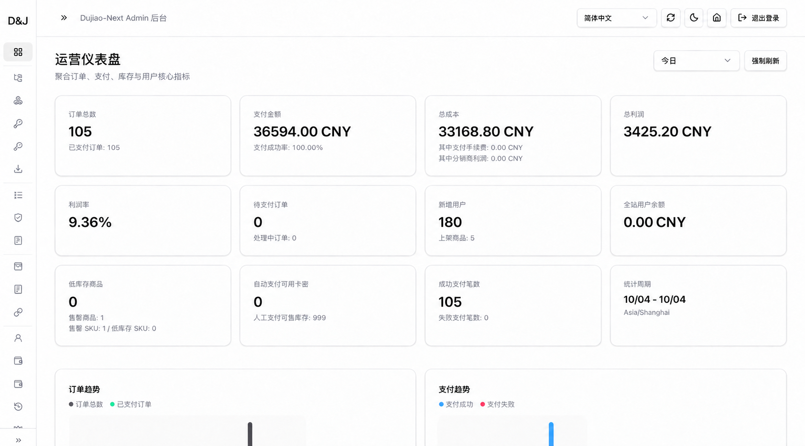

# 我的第一次 AI 创业实验：搭建、经营与退出复盘

作者：Evan ｜ 云期

更新：2026-10-09

**我用 Codex 和开源商城，把一门自己做过分销的生意拆开，搭出了主站，接通采购、支付与交付，再亲自面对获客和售后。最后，我决定停止扩张，把精力放回课程，把过程和代码公开。**

这不是一份“被动收入成功案例”。它记录的是一个大一学生，怎样从发现机会走到实际交付，又怎样根据结果修正自己的判断。集中搭建的三天与随后经营的时间分开计算；已有订单、退款和售后责任并不因决定退出而结束。

## 我究竟做了什么

最初，我是别人平台的分销商，主要负责推广和销售。拿到真实订单后，我想争取更多供货与定价选择，也希望让其他商家通过自己的系统销售。

我购买域名和服务器，选择 Dujiao-Next 作为代码基础，让 Codex 帮我阅读和修改代码，再由我配置商品、对接供应商和支付服务，实际下单、检查交付，并反馈异常。具体过程见[我的三天三夜](我的三天三夜.md)，流程与源码入口见[从分销经历反推系统](从分销经历反推系统.md)和[系统与代码导读](系统与代码导读.md)。

| 参与方 | 贡献与边界 |
| --- | --- |
| Dujiao-Next 开源项目 | 提供商城与应用基础；保留来源和 GPL v3 许可证，不能把原有功能全算成我的原创 |
| Codex | 协助阅读源码、编写改动、排查错误及运行环境允许的检查；我不把这些代码描述为自己独立手写 |
| 我 | 提出业务需求、比较与选择方案、联系上下游、配置与部署、真实购买测试、推广和客户售后 |
| 供应商与支付服务 | 提供实际采购、兑换及收款能力；我搭建的销售系统不等于自行实现了上游充值服务 |

我得到的能力不是“几天成为全栈工程师”，而是开始学会把一个目标拆成可检查的环节，并组织现有工具把它完成。代码能运行也不等于已经做过完整安全审计；实际检查范围见[发布包检查记录](发布包检查记录.md)。

## 经营记录与统计口径

以下为我提供的后台展示数据。我确认这份统计的区间是 **2026 年 10 月 3 日至 10 月 9 日，含首尾共七天**。

| 后台字段 | 展示值 | 本文如何使用 |
| --- | ---: | --- |
| 已支付订单 | 105 笔 | 订单数量，不等同于 105 位独立付费用户 |
| 支付金额 | 36,594.00 元 | 后台支付金额，不作为扣除退款、费用后的净收入 |
| 总成本 | 33,168.80 元 | 后台成本字段，不据此认定已经覆盖全部经营成本 |
| 总利润 | 3,425.20 元 | 与上述支付金额减总成本相符；不是最终项目净利润 |
| 利润率 | 9.36% | 上述后台差额占支付金额的比例，不是投入资金回报率 |

**配图说明：**保留作者提供图的原始内容，没有修改金额或日期标签。图上仍显示“今日”和“10/04–10/04”，与我补充确认的 10/03–10/09 区间不一致，因此七天区间是作者说明，并非由这张图独立证明。公开仓库不包含逐笔订单与支付结算流水，这些数字不是经第三方审计的经营结论。

此前交流中提到过“约一万元营业额”，与本次后台展示的统计差异尚未逐单核对；本文不把两组金额相加，也不据此计算增长率。最终净收益仍需核对退款、手续费、供应商补差、代理结算，以及服务器、域名和工具等费用，避免漏计或重复计入。

此外，我在这次决定收尾时记录到两名分销商。人数不等于活跃渠道，也不等于这些商家都已产生终端成交。没有完整的分销订单和复购记录，我不能把它称作一个已经验证的分销网络。

## 为什么有成交，仍然决定收尾

**第一，我低估了注意力成本。** 系统可以自动交付卡密，但客户遇到问题时，仍要由我判断、解释和跟进。简单的问题也会打断学习，自动化并没有让生意自动变成被动收入。

**第二，我把供货与系统自主权，高估成了经营优势。** 自己搭主站，可以选择供应商和修改流程；与此同时，服务器、工具、支付异常和售后都变成自己的责任。零售能卖出去，并不能证明招代理后销量会自然增长。

**第三，校园信任不是免费资源。** 推广受到质疑，让我看到读者会关心来源、责任和退出方式。学校身份可以让人愿意了解我，但不能替代交付记录，也不能要求别人天然相信我的模式。

**第四，这件事开始挤占更重要的选择。** 忙于网站和订单时，我没有及时完成高数、线性代数作业。对我当前阶段而言，课程、绩点和转专业准备，比继续扩大这门需要持续照看的生意更重要。

所以我选择停止扩张、做好收尾。已经投入的费用和熬过的夜，是复盘的素材，不是必须继续做下去的理由。

## 下一次，我会怎样做得更好

| 这次暴露的问题 | 下一次的具体做法 |
| --- | --- |
| 先补齐平台能力，再期待客户与代理增长 | 先用现成工具完成小批量交付，记录付费、复购和售后，再决定是否建系统 |
| 用销售差价感受赚钱，没有完整衡量时间 | 逐单记收入、采购、退款与费用；同时记录获客和售后用时，单独核算固定投入 |
| 把代理报名当作规模化的起点 | 先观察一位代理能否独立获客、成交并处理交付，再判断模式是否可复制 |
| 功能越做越多，学习时间不断让位 | 在投入前设定时间和预算上限；一旦影响课程，就缩小范围或暂停 |
| 想靠个人 IP 获得信任 | 先持续公开能解释、能复现的作品与复盘，不用未经核实的业绩代替信用 |

## 这段经历怎样介绍

> 我在大一做过一次 AI 辅助的订阅商城创业实验。先作为分销商验证有人愿意购买，随后基于 Dujiao-Next，用 Codex 协助定制和部署主站，接通商品采购、支付、交付与分销流程。我负责需求、上下游沟通、配置测试和实际运营，不把开源基座或 AI 编写的代码说成全部由我原创。经营后，我发现售后、获客与维护的投入超过了预期，也影响了课程学习，于是决定收尾并开源代码和复盘。这段经历让我第一次把“做出系统”“卖出商品”和“形成可持续生意”分开看。

我愿意展示成果，也愿意解释没有做成的部分。**这个项目最有价值的，不是证明我从一开始就判断正确，而是留下我怎样行动、验证和改变决定的记录。**
